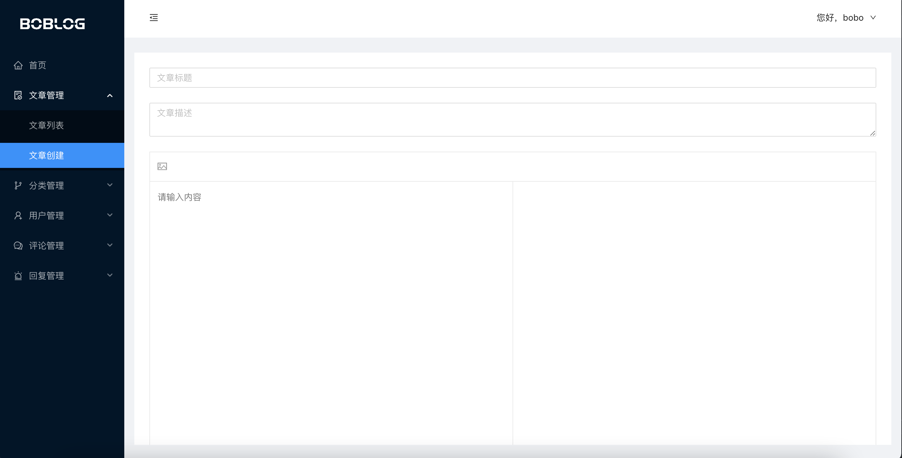

## React.js 博客管理后台

一个基于 React.js 完整的管理后台，包含登录权限，文章管理，分类管理，用户管理，评论管理，回复管理模块

- 技术栈：React.js, Reack-Hooks, react-redux, react-router, react-query
- UI 框架：Ant-Design

技术亮点：
- 根据官方脚手架 CRA 版本从 0 - 1 搭建，结合 antd UI 框架，完成清晰的项目架构目录
- React Hook，自定义 Hooks 复用方法，提高项目开发效率
- 状态管理 Redux Toolkit，React Query 管理服务端状态
- 路由懒加载，减少打包体积
- 搭建极简版 markdown 编辑器，轻量快捷，让写 md 更加清爽
- Node.js 服务端 API 接口项目：[https://github.com/lfb/nodejs-koa-blog](https://github.com/lfb/nodejs-koa-blog)
- 欢迎大家指导~

## 安装启动
```
# 安装包
npm install 或者 yarn install

# 启动
npm start 或者 yarn start
```



